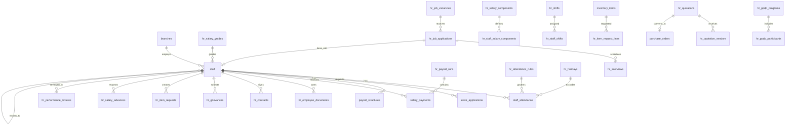
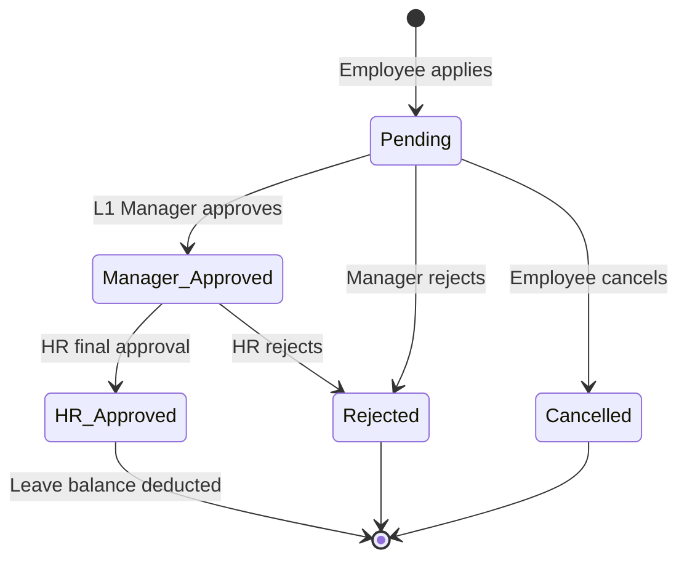
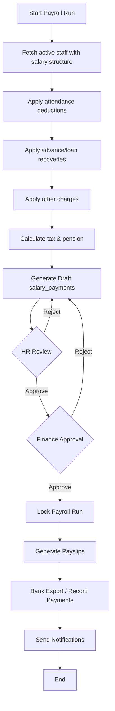
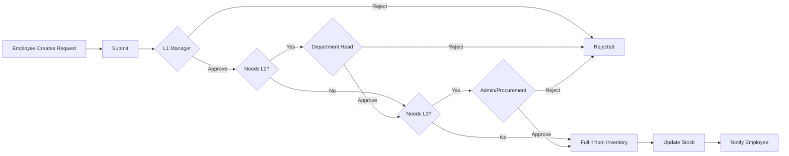
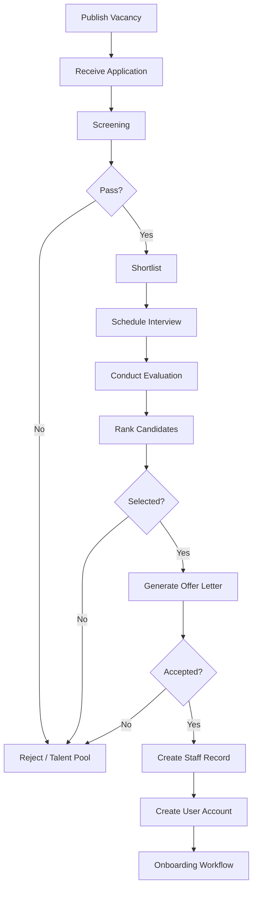
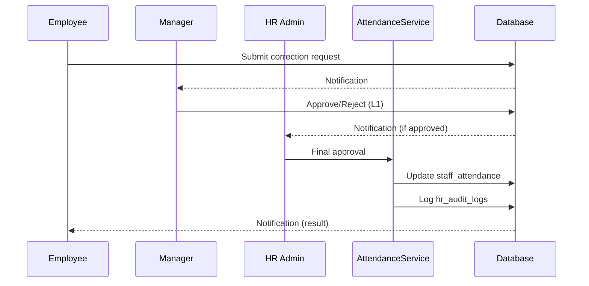

# TacliinHub HRM & Payroll Management Module
## Enterprise Specification Document

**Document Version:** 1.0  
**Date:** June 26, 2025  
**System:** TacliinHub Education Management System  
**Scope:** Human Resource Management (HRM) & Payroll — Enterprise Enhancement  
**Status:** Approved for Development Planning  

---

## Table of Contents

1. [Executive Summary](#1-executive-summary)
2. [Current State Assessment](#2-current-state-assessment)
3. [Target Architecture](#3-target-architecture)
4. [Module Specifications](#4-module-specifications)
5. [Database Design & ERD](#5-database-design--erd)
6. [Permissions Matrix & User Roles](#6-permissions-matrix--user-roles)
7. [Workflow Diagrams](#7-workflow-diagrams)
8. [REST API Architecture](#8-rest-api-architecture)
9. [Notifications & Audit Strategy](#9-notifications--audit-strategy)
10. [Dashboard & Analytics](#10-dashboard--analytics)
11. [Reports Catalog](#11-reports-catalog)
12. [Implementation Roadmap](#12-implementation-roadmap)
13. [Non-Functional Requirements](#13-non-functional-requirements)
14. [Appendices](#14-appendices)

---

## 1. Executive Summary

### 1.1 Purpose

This document defines the enterprise-level functional, technical, and operational requirements for enhancing TacliinHub's HRM & Payroll Management capabilities. It is designed for product owners, architects, developers, QA engineers, and implementation teams.

### 1.2 Design Principles

| Principle | Application |
|-----------|-------------|
| **No Duplication** | Existing features are enhanced and professionalized; net-new features are fully integrated |
| **Branch-Aware** | All HR entities respect existing multi-branch architecture (`branches`, `branch_id`) |
| **RBAC-First** | Granular permissions via existing `modules` / `actions` / `role_action_permissions` system |
| **Audit Everything** | All state-changing operations logged to `activity_logs` + module-specific audit tables |
| **API-Ready** | Web UI, Flutter mobile app, and future integrations share unified REST endpoints |
| **Incremental Delivery** | Phased rollout preserving current production HR operations |

### 1.3 Technology Context

TacliinHub is a **custom PHP + MySQL** school ERP (not Laravel). This specification applies **Laravel-style best practices** as architectural patterns:

- Service layer separation (`includes/services/HrService.php`)
- Repository pattern for data access
- Request validation classes
- Consistent REST resource naming
- Migration-based schema versioning (`database/migrations/`)

> **Note:** A future Laravel migration is out of scope for Phase 1. Patterns below are adapted to the existing PHP codebase.

---

## 2. Current State Assessment

### 2.1 Existing Inventory (DO NOT Rebuild)

| Area | Status | Location | Tables |
|------|--------|----------|--------|
| Staff Registration & Profiles | ✅ Exists | `modules/hr/staff.php`, `edit-staff.php`, `view-staff.php` | `staff` |
| Payroll Processing | ✅ Exists | `modules/hr/payroll.php`, `payslip.php` | `payroll_structures`, `salary_payments` |
| Leave Management | ✅ Exists | `modules/hr/leaves.php`, `view-leave.php` | `leave_types`, `leave_applications` |
| Staff Attendance (Basic) | ✅ Exists | `modules/attendance/staff.php`, `ajax/hr/save-staff-attendance.php` | `staff_attendance` |
| Student Attendance | ✅ Exists (separate) | `modules/attendance/student.php` | `student_attendance` |
| Attendance Reports | ✅ Partial | `modules/reports/attendance-reports.php` | — |
| Multi-Branch Support | ✅ Exists | `modules/branches/`, branch filters in HR | `branches` |
| Granular RBAC | ✅ Exists (partial enforcement) | `docs/PERMISSIONS_SYSTEM.md` | `modules`, `actions`, `role_action_permissions` |
| Activity Logging | ✅ Exists | `logActivity()` in `includes/functions.php` | `activity_logs` |
| Flutter HR Mobile | ✅ Exists | `tacliinhub_app/lib/presentation/pages/hr/` | — |
| Inventory Schema | ⚠️ Schema Only | No UI | `inventory_items`, `purchase_orders`, `assets` |
| Support Tickets | ⚠️ Generic (not HR) | `modules/support/tickets.php` | `support_tickets` |

### 2.2 Gap Analysis Summary

| Sub-Module | Gap Level | Action |
|------------|-----------|--------|
| 1. Attendance Management | Medium | Enhance existing; add rules, shifts, approvals, biometric hooks |
| 2. Employee Registration & HR Admin | Medium | Extend `staff`; add documents, contracts, org structure |
| 3. Attendance Rules & Policies | High | **New module** |
| 4. Complaints & Grievance | High | **New module** (extend, do not duplicate support tickets) |
| 5. Item Request & Approval | High | **New module** (leverage inventory schema) |
| 6. Quotation Management | High | **New module** |
| 7. PPDP Program Management | High | **New module** |
| 8. Payroll & Salary Management | Medium | Enhance existing payroll engine |
| 9. Advanced Salary Management | High | **New module** (advances, loans) |
| 10. Salary Deductions & Charges | Medium | Enhance payroll structure model |
| 11. Employee Reporting & Analytics | Medium | **New HR dashboard** + enhance reports |
| 12. Recruitment & Job Seeker | High | **New module** |

### 2.3 Enhancement vs. New Build Matrix

```
LEGEND: [E] Enhance Existing  |  [N] Net New  |  [I] Integrate Existing

Sub-Module                          Action
─────────────────────────────────────────────────────────
Employee Attendance                 [E] staff_attendance + attendance module
Teacher Attendance                  [E] Filter staff by designation=Teacher
Daily Tracking                      [E] Already exists
Attendance List/Reports             [E] attendance-reports.php
Attendance Analytics Dashboard      [N] modules/hr/dashboard.php
Attendance Approval Workflow        [N] Correction requests
Attendance Corrections              [N]
Late/Early/Overtime Tracking        [N] Extend staff_attendance
Biometric/QR Integration            [N] API hooks + device registry
Day Off / Public Holidays           [N] hr_holidays table
Leave Calendar                      [E] Integrate leave_applications + calendar

Staff Registration                  [E] staff CRUD
Employee Documents                  [N]
Contracts/Promotions/Transfers      [N]
ID Card Generation                  [N]
Reporting Structure                 [N]
Performance Tracking                [N]

Payroll Processing                  [E] process-payroll.php
Salary Grades/Bands                 [N]
Payslip Generation                  [E] payslip.php → PDF export
Bank Transfer Export                [N]
Advance Salary / Loans              [N]

Recruitment                         [N] Full module
PPDP                                [N] Full module
Quotations                          [N] Full module
Item Requests                       [N] UI on inventory schema
Grievances                          [N] HR-specific (not support tickets)
```

---

## 3. Target Architecture

### 3.1 Module Directory Structure

```
modules/hr/
├── dashboard.php                    # HR Analytics Dashboard [NEW]
├── staff.php                        # [ENHANCE] Active/Inactive tabs, directory view
├── edit-staff.php                   # [ENHANCE] Documents, reporting line
├── view-staff.php                   # [ENHANCE] Full profile, history timeline
├── employee-documents.php           # [NEW]
├── contracts.php                    # [NEW]
├── promotions-transfers.php         # [NEW]
├── terminations.php                 # [NEW]
├── id-cards.php                     # [NEW]
├── org-chart.php                    # [NEW]
├── performance.php                  # [NEW]
├── payroll.php                      # [ENHANCE] Approval workflow, dashboard widgets
├── payslip.php                      # [ENHANCE] PDF/Excel export
├── salary-grades.php                # [NEW]
├── salary-charges.php               # [NEW]
├── advance-salary.php               # [NEW]
├── salary-loans.php                 # [NEW]
├── leaves.php                       # [ENHANCE] Balance, calendar, multi-level approval
├── leave-calendar.php               # [NEW]
├── holidays.php                     # [NEW]
├── attendance/
│   ├── dashboard.php                # [NEW] Attendance analytics
│   ├── daily.php                    # [ENHANCE] From modules/attendance/staff.php
│   ├── corrections.php              # [NEW]
│   ├── approvals.php                # [NEW]
│   ├── overtime.php                 # [NEW]
│   └── rules.php                    # [NEW] Policies configuration
├── grievances/
│   ├── list.php                     # [NEW]
│   ├── submit.php                   # [NEW]
│   └── view.php                     # [NEW]
├── item-requests/
│   ├── list.php                     # [NEW]
│   ├── create.php                   # [NEW]
│   └── approvals.php                # [NEW]
├── quotations/
│   ├── list.php                     # [NEW]
│   ├── create.php                   # [NEW]
│   └── compare.php                  # [NEW]
├── ppdp/
│   ├── programs.php                 # [NEW]
│   ├── participants.php             # [NEW]
│   └── certificates.php             # [NEW]
└── recruitment/
    ├── vacancies.php                # [NEW]
    ├── applications.php             # [NEW]
    ├── interviews.php               # [NEW]
    ├── candidates.php               # [NEW]
    └── offer-letters.php            # [NEW]

ajax/hr/                             # [ENHANCE] All endpoints + new subfolders
api/v1/hr/                           # [NEW] REST API for mobile/third-party
includes/services/hr/                # [NEW] Business logic layer
database/migrations/hr/              # [NEW] Versioned schema changes
```

### 3.2 Service Layer Architecture

```
┌─────────────────────────────────────────────────────────────┐
│                    Presentation Layer                        │
│  Web (PHP Views)  │  Flutter App  │  External Integrations   │
└────────────┬────────────────┬─────────────────┬───────────────┘
             │                │                 │
┌────────────▼────────────────▼─────────────────▼───────────────┐
│                      API Gateway Layer                           │
│  api/v1/hr/* (REST)          ajax/hr/* (Legacy web AJAX)        │
└────────────┬────────────────────────────────────────────────────┘
             │
┌────────────▼────────────────────────────────────────────────────┐
│                     Service Layer                                │
│  AttendanceService │ PayrollService │ LeaveService │ ...       │
│  WorkflowEngine    │ NotificationService │ AuditService        │
└────────────┬────────────────────────────────────────────────────┘
             │
┌────────────▼────────────────────────────────────────────────────┐
│                   Repository Layer                               │
│  StaffRepository │ AttendanceRepository │ PayrollRepository     │
└────────────┬────────────────────────────────────────────────────┘
             │
┌────────────▼────────────────────────────────────────────────────┐
│              MySQL Database (branch-scoped)                      │
└─────────────────────────────────────────────────────────────────┘
```

### 3.3 Multi-Branch & Multi-Campus Model

**Current:** `branches` table with `branch_id` on staff, attendance, payroll.

**Enhancement:**

| Entity | Scope Field | Notes |
|--------|-------------|-------|
| All HR records | `branch_id` | Required; inherited from staff |
| Attendance rules | `branch_id` NULL = global default | Branch overrides allowed |
| Holidays | `branch_id` + `is_national` | National holidays apply to all |
| Recruitment vacancies | `branch_id` | Career portal filters by branch |
| PPDP programs | `branch_id` or multi-branch JSON | Cross-campus programs supported |
| Campus | `campus_id` (optional FK on `branches`) | Add `campuses` table if institution has multiple campuses per branch |

**Proposed `campuses` table (optional Phase 2):**

```sql
CREATE TABLE campuses (
  id INT PRIMARY KEY AUTO_INCREMENT,
  campus_code VARCHAR(20) NOT NULL UNIQUE,
  campus_name VARCHAR(150) NOT NULL,
  branch_id INT NOT NULL,
  address TEXT,
  is_active TINYINT(1) DEFAULT 1,
  FOREIGN KEY (branch_id) REFERENCES branches(id)
);
ALTER TABLE staff ADD COLUMN campus_id INT NULL AFTER branch_id;
```

---

## 4. Module Specifications

### 4.1 Attendance Management

#### 4.1.1 Existing Features (Enhance)

| Feature | Current | Enhancement |
|---------|---------|-------------|
| Staff daily marking | Manual status + check_in/out | Auto-calculate late/early from rules |
| Teacher attendance | Same as staff | Designation filter + class-linked view |
| Attendance list | Date-based list | Advanced filters, bulk export |
| Reports | Daily/monthly/department | Add trend charts, heatmaps |
| Mobile marking | Flutter `staff_attendance_page.dart` | QR scan endpoint, offline sync |

#### 4.1.2 New Features

**A. Attendance Rules Configuration (`hr_attendance_rules`)**

| Field | Description |
|-------|-------------|
| `rule_name` | e.g., "Standard Office Hours" |
| `branch_id` | Branch scope |
| `work_start_time` | Default 08:00 |
| `work_end_time` | Default 17:00 |
| `grace_period_minutes` | Late tolerance |
| `half_day_threshold_hours` | Minimum hours for half day |
| `overtime_threshold_minutes` | When OT starts |
| `weekend_days` | JSON: [5,6] for Fri/Sat |
| `auto_mark_absent_after` | Time if no check-in |

**B. Shift Management (`hr_shifts`, `hr_staff_shifts`)**

- Define named shifts (Morning, Evening, Night)
- Assign staff to shifts with effective date ranges
- Support rotating schedules

**C. Attendance Correction Workflow (`hr_attendance_corrections`)**

```
Employee submits correction → Line Manager approves → HR Admin finalizes → Audit logged
```

States: `Draft`, `Submitted`, `Manager_Approved`, `HR_Approved`, `Rejected`

**D. Late Arrival / Early Departure / Overtime**

Extend `staff_attendance`:

```sql
ALTER TABLE staff_attendance ADD COLUMN late_minutes INT DEFAULT 0;
ALTER TABLE staff_attendance ADD COLUMN early_departure_minutes INT DEFAULT 0;
ALTER TABLE staff_attendance ADD COLUMN overtime_minutes INT DEFAULT 0;
ALTER TABLE staff_attendance ADD COLUMN attendance_source ENUM('Manual','Biometric','QR','Mobile','Import') DEFAULT 'Manual';
ALTER TABLE staff_attendance ADD COLUMN is_approved TINYINT(1) DEFAULT 1;
ALTER TABLE staff_attendance ADD COLUMN approved_by INT NULL;
```

**E. Attendance Deletion Authorization**

- Delete requires `hr.attendance.delete_authorized` permission
- Soft-delete with `deleted_at`, `deleted_by`, `deletion_reason`
- Mandatory audit log entry

**F. Biometric Integration Ready**

`hr_biometric_devices` registry + webhook endpoint:

```
POST /api/v1/hr/attendance/biometric/punch
Body: { device_id, staff_biometric_id, punch_time, punch_type: "IN"|"OUT" }
```

**G. QR Code Attendance**

- Generate daily QR tokens per branch/location (`hr_qr_sessions`)
- Mobile scan validates token + GPS (optional)
- Endpoint: `POST /api/v1/hr/attendance/qr-checkin`

**H. Public Holidays & Day Off (`hr_holidays`)**

| Field | Description |
|-------|-------------|
| `holiday_name` | Eid, Independence Day, etc. |
| `holiday_date` | Date |
| `branch_id` | NULL = all branches |
| `is_recurring` | Annual recurrence |
| `holiday_type` | Public, Institutional, Optional |

**I. Leave Calendar**

- Unified calendar view: approved leaves + holidays + day-offs
- iCal export, branch filter, department filter
- Integrates `leave_applications` + `hr_holidays`

#### 4.1.3 Attendance Analytics Dashboard Widgets

- Present/Absent/Late % (today, week, month)
- Department-wise attendance heatmap
- Top late arrivals (rolling 30 days)
- Overtime hours by department
- Attendance correction pending count
- Biometric vs manual source breakdown

---

### 4.2 Employee Registration & HR Administration

#### 4.2.1 Enhance Existing `staff` Module

**Current fields preserved.** Add:

```sql
ALTER TABLE staff ADD COLUMN reports_to INT NULL COMMENT 'FK to staff.id';
ALTER TABLE staff ADD COLUMN employee_grade_id INT NULL;
ALTER TABLE staff ADD COLUMN national_id VARCHAR(50) NULL;
ALTER TABLE staff ADD COLUMN passport_no VARCHAR(50) NULL;
ALTER TABLE staff ADD COLUMN marital_status ENUM('Single','Married','Divorced','Widowed') NULL;
ALTER TABLE staff ADD COLUMN blood_group VARCHAR(5) NULL;
ALTER TABLE staff ADD COLUMN probation_end_date DATE NULL;
ALTER TABLE staff ADD COLUMN confirmation_date DATE NULL;
```

#### 4.2.2 Employee Entry Process (Workflow)

```
HR creates draft profile → Document upload → Contract generation → 
Department head approval → Account provisioning (users table) → Active
```

Status enum extension: `Draft`, `Pending_Approval`, `Active`, `On_Probation`, `Suspended`, `Inactive`, `Resigned`, `Terminated`

#### 4.2.3 Employee Documents (`hr_employee_documents`)

| Field | Description |
|-------|-------------|
| `staff_id` | Employee |
| `document_type` | Contract, ID Copy, Certificate, Medical, etc. |
| `file_path` | Secure upload path |
| `expiry_date` | For licenses/certificates |
| `is_verified` | HR verification flag |
| `verified_by` | User ID |

#### 4.2.4 Employee Contracts (`hr_contracts`)

- Contract type: Permanent, Fixed-Term, Probation, Consultancy
- Start/end dates, renewal alerts (90/30/7 day notifications)
- Salary linkage to `payroll_structures`
- Digital signature support (Phase 3)

#### 4.2.5 Promotions & Transfers (`hr_staff_movements`)

| movement_type | Fields |
|---------------|--------|
| Promotion | old_designation, new_designation, old_grade, new_grade, effective_date |
| Transfer | old_branch_id, new_branch_id, old_department, new_department |
| Termination | reason, exit_interview, clearance_checklist, final_settlement_ref |

#### 4.2.6 Employee ID Card Generation

- Template-based PDF/card image generation
- QR code linking to verified employee profile (public-safe fields only)
- Bulk generation by branch/department
- Print queue management

#### 4.2.7 Employee Directory

- Searchable directory with photo, designation, department, contact
- Org-chart visualization (`reports_to` hierarchy)
- Export vCard, PDF directory

#### 4.2.8 Employee Performance Tracking (`hr_performance_reviews`)

| Field | Description |
|-------|-------------|
| `review_period` | Q1 2025, Annual 2024 |
| `reviewer_id` | Manager staff_id |
| `rating` | 1-5 scale |
| `kpis` | JSON array of KPI scores |
| `comments` | Text |
| `status` | Draft, Submitted, Acknowledged, Archived |

---

### 4.3 Attendance Rules & Policies

Centralized policy engine consumed by Attendance Service.

#### 4.3.1 Configuration Modules

| Config Type | Table | Key Rules |
|-------------|-------|-----------|
| Working Hours | `hr_attendance_rules` | Start/end, breaks |
| Shifts | `hr_shifts` | Named shift definitions |
| Flexible Schedules | `hr_flexible_schedules` | Core hours + flex window |
| Leave Policies | `hr_leave_policies` | Accrual, carry-forward, max consecutive |
| Late Penalty Rules | `hr_late_penalty_rules` | Deduction tiers by minutes late |
| Overtime Rules | `hr_overtime_rules` | Rate multipliers, caps |
| Holiday Rules | `hr_holidays` | Auto-exclude from attendance |

#### 4.3.2 Automatic Attendance Calculation Engine

**AttendanceCalculationService** runs on:

1. Check-in/out recorded
2. End-of-day batch job
3. Payroll processing trigger

**Calculations:**

```
late_minutes = MAX(0, check_in - work_start - grace_period)
early_departure = MAX(0, work_end - check_out)  [if left early]
worked_hours = check_out - check_in - break_duration
overtime_minutes = MAX(0, worked_hours - standard_hours - overtime_threshold)
status = derive_status(present, late_minutes, worked_hours, on_leave, on_holiday)
penalty_amount = apply_late_penalty_rules(late_minutes, month_cumulative)
```

---

### 4.4 Complaints & Grievance Management

> **Distinct from** `modules/support/tickets.php` (IT/general support).  
> HR Grievances link to `staff_id`, follow HR escalation, support anonymity.

#### 4.4.1 Tables

**`hr_grievances`**

| Field | Type | Notes |
|-------|------|-------|
| `grievance_no` | VARCHAR(20) | GRV000001 |
| `staff_id` | INT NULL | NULL if anonymous |
| `is_anonymous` | TINYINT(1) | Hide submitter from assignee |
| `category` | ENUM | Harassment, Discrimination, Working Conditions, Payroll, Other |
| `subject` | VARCHAR(255) | |
| `description` | TEXT | |
| `priority` | ENUM | Low, Medium, High, Critical |
| `status` | ENUM | Submitted, Under_Review, Investigating, Resolved, Closed, Escalated |
| `assigned_to` | INT | HR officer user_id |
| `branch_id` | INT | |
| `resolution` | TEXT | |
| `resolved_at` | DATETIME | |

**`hr_grievance_actions`** — timeline of status changes, notes (internal vs visible)

#### 4.4.2 Workflow

```
Submit → Triage (HR) → Investigate → Propose Resolution → 
Employee Acknowledgment → Close → (Optional) Escalate to Director
```

#### 4.4.3 Reports

- Grievances by category/status/branch/month
- Average resolution time
- Anonymous vs identified ratio
- Repeat complainant flag (privacy-compliant)

---

### 4.5 Item Request & Approval Workflow

Leverages existing `inventory_items`, `inventory_categories`.

#### 4.5.1 New Tables

**`hr_item_requests`**

| Field | Description |
|-------|-------------|
| `request_no` | REQ000001 |
| `staff_id` | Requester |
| `branch_id` | |
| `purpose` | Business justification |
| `priority` | Normal, Urgent |
| `status` | Draft, Submitted, L1_Approved, L2_Approved, Fulfilled, Rejected, Cancelled |

**`hr_item_request_lines`**

| Field | Description |
|-------|-------------|
| `request_id` | FK |
| `inventory_item_id` | FK (nullable for free-text items) |
| `item_description` | |
| `quantity_requested` | |
| `quantity_approved` | |
| `quantity_issued` | |

**`hr_approval_workflows`** — reusable multi-level approval config

#### 4.5.2 Multi-Level Approval

Configurable per request type:

| Level | Approver Role | Condition |
|-------|---------------|-----------|
| L1 | Line Manager | Always |
| L2 | Department Head | qty > 5 OR value > threshold |
| L3 | Admin/Procurement | value > high threshold |

#### 4.5.3 Inventory Integration

On fulfillment:
1. Deduct `inventory_items.quantity`
2. Create `inventory_transactions` log
3. Optionally create `purchase_orders` if stock insufficient

---

### 4.6 Quotation Management

#### 4.6.1 Tables

**`hr_quotations`**

| Field | Description |
|-------|-------------|
| `quotation_no` | QUO000001 |
| `title` | Request title |
| `description` | |
| `requested_by` | staff_id |
| `branch_id` | |
| `required_by_date` | |
| `status` | Draft, Pending_Approval, Approved, Rejected, Closed |
| `approved_by` | |
| `total_estimated` | DECIMAL |

**`hr_quotation_vendors`** — vendor responses per quotation

| Field | Description |
|-------|-------------|
| `quotation_id` | |
| `vendor_name` | |
| `vendor_contact` | |
| `quoted_amount` | |
| `delivery_days` | |
| `attachment_path` | |
| `is_selected` | Winner flag |

#### 4.6.2 Features

- Create quotation with line not line items
- Vendor quotation upload and tracking
- Side-by-side comparison tool (`modules/hr/quotations/compare.php`)
- Approval workflow before PO creation
- Link approved quotation → `purchase_orders`

#### 4.6.3 Reports

- Quotations by status/month
- Vendor performance (avg price, delivery time)
- Savings analysis (selected vs highest bid)

---

### 4.7 PPDP Program Management

> PPDP = Professional/Pedagogical Development Program (teacher/staff training)

#### 4.7.1 Tables

**`hr_ppdp_programs`**

| Field | Description |
|-------|-------------|
| `program_code` | PPDP-2025-001 |
| `program_name` | |
| `description` | |
| `start_date`, `end_date` | |
| `capacity` | Max participants |
| `branch_id` | |
| `facilitator_id` | staff_id |
| `status` | Planned, Open, In_Progress, Completed, Cancelled |

**`hr_ppdp_participants`**

| Field | Description |
|-------|-------------|
| `program_id` | |
| `staff_id` | |
| `registration_date` | |
| `status` | Registered, Attending, Completed, Dropped, Failed |
| `progress_percent` | 0-100 |
| `assessment_score` | |
| `certificate_id` | FK when completed |

**`hr_ppdp_sessions`** — program schedule (date, topic, location)

**`hr_ppdp_certificates`** — certificate number, issue date, template, file_path

#### 4.7.2 Features

- Self-registration portal for eligible staff
- Session attendance tracking
- Progress milestones
- Certificate auto-generation on completion
- Program reports: completion rate, avg scores, by department

---

### 4.8 Payroll & Salary Management

#### 4.8.1 Enhance Existing

| Existing | Enhancement |
|----------|-------------|
| `payroll_structures` | Link to salary grades; componentized allowances/deductions |
| `process-payroll.php` | Add approval workflow before payment |
| `payslip.php` | PDF generation, email delivery, bulk download |
| `salary_payments` | Itemized breakdown JSON column |

#### 4.8.2 Salary Structure Setup

**`hr_salary_grades`**

| Field | Description |
|-------|-------------|
| `grade_code` | G1, G2, ... |
| `grade_name` | Senior Teacher |
| `min_salary`, `max_salary` | Band range |
| `branch_id` | Optional scope |

**`hr_salary_bands`** — steps within grade (Step 1, Step 2, ...)

**`hr_salary_components`** — master list of earnings/deductions

| component_type | Examples |
|----------------|----------|
| Earning | Basic, Housing, Transport, Medical, Bonus |
| Deduction | Tax, Pension, Loan, Advance Recovery, Late Penalty |

**`hr_staff_salary_components`** — staff-specific component values (replaces flat columns in `payroll_structures`)

#### 4.8.3 Monthly Payroll Processing Workflow

```
Draft Run → HR Review → Finance Approval → Locked → Payment Processing → Payslip Distribution
```

**`salary_payments` extensions:**

```sql
ALTER TABLE salary_payments ADD COLUMN payroll_run_id INT NULL;
ALTER TABLE salary_payments ADD COLUMN status ENUM('Draft','Pending_Approval','Approved','Paid','Cancelled') DEFAULT 'Draft';
ALTER TABLE salary_payments ADD COLUMN component_breakdown JSON NULL;
ALTER TABLE salary_payments ADD COLUMN approved_by INT NULL;
ALTER TABLE salary_payments ADD COLUMN approved_at DATETIME NULL;
```

**`hr_payroll_runs`** — batch header for monthly processing

#### 4.8.4 Payslip Generation

- HTML template → PDF (TCPDF/Dompdf — match existing fee invoice approach)
- Email to staff on approval
- Password-protected PDF option (last 4 of phone)
- Bulk ZIP export

#### 4.8.5 Bank Transfer Export

- CSV/Excel formats per bank template (configurable)
- Fields: account_no, bank_code, net_salary, reference, staff_name
- Reconciliation report post-export

#### 4.8.6 Payroll Dashboard Widgets

- Total payroll cost (current month vs last month)
- Pending approvals count
- Staff without salary structure
- Deductions breakdown pie chart
- Payment status funnel

---

### 4.9 Advanced Salary Management

#### 4.9.1 Advance Salary (`hr_salary_advances`)

| Field | Description |
|-------|-------------|
| `advance_no` | ADV000001 |
| `staff_id` | |
| `requested_amount` | |
| `approved_amount` | |
| `reason` | |
| `recovery_months` | Installment count |
| `monthly_recovery` | Auto-calculated |
| `total_recovered` | Running total |
| `status` | Pending, Approved, Rejected, Disbursed, Fully_Recovered |

**Workflow:** Employee request → Manager approve → Finance approve → Disburse → Auto-deduct in payroll

#### 4.9.2 Salary Loans (`hr_salary_loans`)

Extended version with interest (optional), collateral notes, guarantor.

**`hr_loan_installments`** — scheduled deductions linked to payroll runs

#### 4.9.3 Recovery Integration

PayrollCalculationService auto-applies:
1. Active advance recoveries
2. Loan installments
3. Other outstanding deductions

---

### 4.10 Salary Deductions & Additional Charges

#### 4.10.1 Other Charges (`hr_other_charges`)

Ad-hoc charges (uniform, damage, training fee) applied to specific staff/month.

| Field | Description |
|-------|-------------|
| `staff_id` | |
| `charge_type_id` | FK to charge types |
| `amount` | |
| `charge_month` | Applied in payroll month |
| `is_recurring` | |
| `status` | Pending, Applied, Waived |

#### 4.10.2 Tax & Pension

**`hr_tax_configurations`** — brackets, rates per branch/country  
**`hr_pension_configurations`** — employee/employer contribution %

Auto-calculated during payroll; manual override with audit.

#### 4.10.3 Allowances, Bonuses, Incentives

- One-time bonus entry with approval
- Performance-linked incentive batch import
- Taxable vs non-taxable flag per component

#### 4.10.4 Reports

- Deduction summary by type/month
- Other charges aging
- Per-employee deduction statement
- Tax/pension remittance report

---

### 4.11 Employee Reporting & Analytics

#### 4.11.1 HR Analytics Dashboard (`modules/hr/dashboard.php`)

**KPI Cards:**
- Total employees (active/inactive/on probation)
- Headcount by department/branch
- Turnover rate (rolling 12 months)
- Open vacancies
- Pending leave requests
- Attendance rate (today)
- Payroll cost MTD
- Grievances open

**Charts:**
- Headcount trend (12 months)
- Department distribution
- Leave utilization by type
- Attendance compliance trend
- Recruitment funnel
- Training completion rate

#### 4.11.2 Report Export

All reports support: **PDF, Excel (XLSX), CSV**

Use existing pattern from `ajax/reports/execute-custom-report.php`.

#### 4.11.3 Standard Reports

| Report | Filters |
|--------|---------|
| Employee Master List | Branch, department, status, designation |
| Attendance Summary | Date range, department, staff |
| Late Arrival Report | Month, threshold |
| Leave Balance Report | Staff, leave type, year |
| Payroll Register | Month, branch, department |
| Payslip Batch | Month, payment status |
| Advance/Loan Outstanding | Staff, status |
| Grievance Summary | Category, status, date range |
| Item Request History | Staff, status, date range |
| Quotation Analysis | Vendor, period |
| PPDP Completion | Program, department |
| Recruitment Pipeline | Vacancy, stage |
| Workforce Statistics | Custom dimensions: age, tenure, gender, type |
| Department Report | Headcount, attendance, payroll per dept |

---

### 4.12 Recruitment & Job Seeker Module

> **Distinct from** `modules/admissions/` (student enrollment).

#### 4.12.1 Tables

**`hr_job_vacancies`**

| Field | Description |
|-------|-------------|
| `vacancy_no` | VAC000001 |
| `job_title` | |
| `department` | |
| `branch_id` | |
| `employment_type` | |
| `description`, Value | Rich text |
| `requirements` | |
| `salary_range_min/max` | Optional |
| `openings` | INT |
| `application_deadline` | |
| `status` | Draft, Published, Closed, Filled, Cancelled |
| `published_at` | |

**`hr_job_applications`**

| Field | Description |
|-------|-------------|
| `application_no` | APP000001 |
| `vacancy_id` | |
| `first_name`, `last_name`, `email`, `phone` | |
| `cv_path` | Upload |
| `cover_letter` | |
| `status` | Applied, Screening, Shortlisted, Interview, Offer, Hired, Rejected |
| `screening_score` | |
| `rank` | |

**`hr_interviews`**

| Field | Description |
|-------|-------------|
| `application_id` | |
| `interview_date` | |
| `interview_type` | Phone, Video, In-Person, Panel |
| `interviewer_ids` | JSON array of staff_ids |
| `location/link` | |
| `status` | Scheduled, Completed, Cancelled, No_Show |

**`hr_interview_evaluations`**

| Field | Description |
|-------|-------------|
| `interview_id` | |
| `evaluator_id` | staff_id |
| `criteria_scores` | JSON |
| `overall_rating` | |
| `recommendation` | Strong Hire, Hire, Maybe, No Hire |
| `comments` | |

**`hr_offer_letters`**

| Field | Description |
|-------|-------------|
| `application_id` | |
| `offered_salary` | |
| `start_date` | |
| `offer_date` | |
| `expiry_date` | |
| `status` | Draft, Sent, Accepted, Declined, Expired |
| `letter_path` | Generated PDF |

**`hr_talent_pool`** — rejected but qualified candidates for future vacancies

#### 4.12.2 Career Portal

Public-facing page: `careers.php` (or subdomain)

- List published vacancies
- Online application form + CV upload
- Application tracking (reference number + email)
- No login required for applicants

#### 4.12.3 Hiring Workflow

```
Publish Vacancy → Receive Applications → Screen → Shortlist → 
Schedule Interview → Evaluate → Rank Candidates → Generate Offer → 
Accept → Convert to Staff Record (auto-create staff + user)
```

#### 4.12.4 Candidate Ranking

Weighted score: screening (30%) + interview avg (50%) + experience match (20%)

---

## 5. Database Design & ERD

### 5.1 Entity Relationship Overview



### 5.2 Complete New Table List

| # | Table Name | Module |
|---|------------|--------|
| 1 | `hr_attendance_rules` | Attendance Policies |
| 2 | `hr_shifts` | Shift Management |
| 3 | `hr_staff_shifts` | Shift Assignment |
| 4 | `hr_flexible_schedules` | Flexible Schedules |
| 5 | `hr_attendance_corrections` | Corrections |
| 6 | `hr_holidays` | Holidays |
| 7 | `hr_biometric_devices` | Biometric |
| 8 | `hr_qr_sessions` | QR Attendance |
| 9 | `hr_leave_policies` | Leave Policies |
| 10 | `hr_leave_balances` | Leave Balances |
| 11 | `hr_late_penalty_rules` | Penalties |
| 12 | `hr_overtime_rules` | Overtime |
| 13 | `hr_employee_documents` | Documents |
| 14 | `hr_contracts` | Contracts |
| 15 | `hr_staff_movements` | Promotions/Transfers |
| 16 | `hr_performance_reviews` | Performance |
| 17 | `hr_grievances` | Grievances |
| 18 | `hr_grievance_actions` | Grievance Timeline |
| 19 | `hr_item_requests` | Item Requests |
| 20 | `hr_item_request_lines` | Request Lines |
| 21 | `hr_approval_workflows` | Approval Config |
| 22 | `hr_approval_steps` | Approval Steps |
| 23 | `hr_quotations` | Quotations |
| 24 | `hr_quotation_vendors` | Vendor Quotes |
| 25 | `hr_ppdp_programs` | PPDP |
| 26 | `hr_ppdp_participants` | PPDP Participants |
| 27 | `hr_ppdp_sessions` | PPDP Sessions |
| 28 | `hr_ppdp_certificates` | Certificates |
| 29 | `hr_salary_grades` | Salary Grades |
| 30 | `hr_salary_bands` | Salary Bands |
| 31 | `hr_salary_components` | Salary Components |
| 32 | `hr_staff_salary_components` | Staff Components |
| 33 | `hr_payroll_runs` | Payroll Batches |
| 34 | `hr_salary_advances` | Advances |
| 35 | `hr_salary_loans` | Loans |
| 36 | `hr_loan_installments` | Loan Schedule |
| 37 | `hr_other_charges` | Other Charges |
| 38 | `hr_tax_configurations` | Tax Config |
| 39 | `hr_pension_configurations` | Pension Config |
| 40 | `hr_job_vacancies` | Recruitment |
| 41 | `hr_job_applications` | Applications |
| 42 | `hr_interviews` | Interviews |
| 43 | `hr_interview_evaluations` | Evaluations |
| 44 | `hr_offer_letters` | Offers |
| 45 | `hr_talent_pool` | Talent Pool |
| 46 | `hr_audit_logs` | HR-specific audit |
| 47 | `inventory_transactions` | Stock movements |
| 48 | `campuses` | Multi-campus (Phase 2) |

### 5.3 Indexing Strategy

```sql
-- High-frequency queries
CREATE INDEX idx_staff_attendance_date_branch ON staff_attendance(attendance_date, staff_id);
CREATE INDEX idx_staff_branch_status ON staff(branch_id, status);
CREATE INDEX idx_leave_applications_status ON leave_applications(status, staff_id);
CREATE INDEX idx_salary_payments_month ON salary_payments(payment_month, status);
CREATE INDEX idx_hr_grievances_status ON hr_grievances(status, branch_id);
CREATE INDEX idx_hr_job_vacancies_published ON hr_job_vacancies(status, application_deadline);
```

### 5.4 Migration Convention

```
database/migrations/hr/
├── 001_hr_attendance_enhancements.sql
├── 002_hr_policy_tables.sql
├── 003_hr_employee_administration.sql
├── 004_hr_grievances.sql
├── 005_hr_item_requests.sql
├── 006_hr_quotations.sql
├── 007_hr_ppdp.sql
├── 008_hr_payroll_enhancements.sql
├── 009_hr_advances_loans.sql
├── 010_hr_recruitment.sql
├── 011_hr_permissions_seed.sql
└── run_hr_migrations.php
```

---

## 6. Permissions Matrix & User Roles

### 6.1 New Granular Module Keys

Register in `modules` table:

| module_key | module_name |
|------------|-------------|
| `hr` | HR & Staff (existing — extend) |
| `hr_attendance` | HR Attendance |
| `hr_payroll` | Payroll |
| `hr_leave` | Leave Management |
| `hr_grievances` | Grievances |
| `hr_items` | Item Requests |
| `hr_quotations` | Quotations |
| `hr_ppdp` | PPDP Programs |
| `hr_recruitment` | Recruitment |
| `hr_reports` | HR Reports |

### 6.2 Extended Actions

Existing: `create`, `view`, `update`, `delete`, `approve`, `reject`, `export`, `print`, `import`, `manage`

Add HR-specific:
- `authorize_delete` — attendance deletion authorization
- `process_payroll` — run payroll batch
- `lock_payroll` — finalize payroll run
- `disburse` — mark payments disbursed
- `convert_to_staff` — hire from recruitment
- `view_anonymous` — view anonymous grievance submitter (restricted)

### 6.3 Permissions Matrix

| Module / Action | Super Admin | Admin | HR Manager | Accountant | Dept Head | Teacher/Staff |
|-----------------|:-----------:|:-----:|:----------:|:----------:|:---------:|:-------------:|
| **hr.view** | ✅ | ✅ | ✅ | ✅ | ✅ | ✅ (own) |
| **hr.create** | ✅ | ✅ | ✅ | ❌ | ❌ | ❌ |
| **hr.update** | ✅ | ✅ | ✅ | ❌ | ❌ | ❌ |
| **hr.delete** | ✅ | ✅ | ❌ | ❌ | ❌ | ❌ |
| **hr_attendance.view** | ✅ | ✅ | ✅ | ❌ | ✅ (dept) | ✅ (own) |
| **hr_attendance.create** | ✅ | ✅ | ✅ | ❌ | ❌ | ❌ |
| **hr_attendance.approve** | ✅ | ✅ | ✅ | ❌ | ✅ | ❌ |
| **hr_attendance.authorize_delete** | ✅ | ✅ | ❌ | ❌ | ❌ | ❌ |
| **hr_leave.view** | ✅ | ✅ | ✅ | ❌ | ✅ (dept) | ✅ (own) |
| **hr_leave.create** | ✅ | ✅ | ✅ | ❌ | ❌ | ✅ (own) |
| **hr_leave.approve** | ✅ | ✅ | ✅ | ❌ | ✅ (L1) | ❌ |
| **hr_payroll.view** | ✅ | ✅ | ✅ | ✅ | ❌ | ✅ (own payslip) |
| **hr_payroll.process_payroll** | ✅ | ✅ | ❌ | ✅ | ❌ | ❌ |
| **hr_payroll.approve** | ✅ | ✅ | ❌ | ✅ | ❌ | ❌ |
| **hr_payroll.lock_payroll** | ✅ | ✅ | ❌ | ✅ | ❌ | ❌ |
| **hr_grievances.view** | ✅ | ✅ | ✅ | ❌ | ❌ | ✅ (own) |
| **hr_grievances.create** | ✅ | ✅ | ✅ | ❌ | ❌ | ✅ |
| **hr_grievances.manage** | ✅ | ✅ | ✅ | ❌ | ❌ | ❌ |
| **hr_grievances.view_anonymous** | ✅ | ✅ | ✅* | ❌ | ❌ | ❌ |
| **hr_items.view** | ✅ | ✅ | ✅ | ❌ | ✅ (dept) | ✅ (own) |
| **hr_items.approve** | ✅ | ✅ | ✅ | ❌ | ✅ (L1) | ❌ |
| **hr_quotations.view** | ✅ | ✅ | ✅ | ✅ | ❌ | ❌ |
| **hr_quotations.approve** | ✅ | ✅ | ✅ | ✅ | ❌ | ❌ |
| **hr_ppdp.view** | ✅ | ✅ | ✅ | ❌ | ✅ | ✅ |
| **hr_ppdp.manage** | ✅ | ✅ | ✅ | ❌ | ❌ | ❌ |
| **hr_recruitment.view** | ✅ | ✅ | ✅ | ❌ | ❌ | ❌ |
| **hr_recruitment.manage** | ✅ | ✅ | ✅ | ❌ | ❌ | ❌ |
| **hr_recruitment.convert_to_staff** | ✅ | ✅ | ✅ | ❌ | ❌ | ❌ |
| **hr_reports.view** | ✅ | ✅ | ✅ | ✅ | ✅ (dept) | ❌ |
| **hr_reports.export** | ✅ | ✅ | ✅ | ✅ | ✅ | ❌ |

*Limited to designated grievance officers only via user override.

### 6.4 New Role Recommendation

Add **`HR Manager`** role to `roles` table:

- Full HR module access except system settings
- Grievance investigation authority
- Payroll view but not lock (separation of duties)
- Recruitment management

### 6.5 Enforcement Requirements

1. Replace `requireRole()` in all HR pages with `requirePermission('hr_*', 'action')`
2. All AJAX endpoints validate permissions server-side
3. Flutter app reads permissions from `ajax/auth/get-permissions.php`
4. Branch scoping enforced in repository layer, not just UI

---

## 7. Workflow Diagrams

### 7.1 Leave Approval (Multi-Level)



### 7.2 Monthly Payroll Processing



### 7.3 Item Request Approval



### 7.4 Recruitment Hiring Pipeline



### 7.5 Attendance Correction



---

## 8. REST API Architecture

### 8.1 API Design Standards

**Base URL:** `/api/v1/hr/`

**Authentication:** Bearer token (extend existing `api/auth/` JWT/session token)

**Response Format:**

```json
{
  "success": true,
  "data": { },
  "meta": {
    "page": 1,
    "per_page": 20,
    "total": 150
  },
  "message": "OK"
}
```

**Error Format:**

```json
{
  "success": false,
  "error": {
    "code": "PERMISSION_DENIED",
    "message": "You do not have permission to process payroll"
  }
}
```

### 8.2 API Endpoint Catalog

#### Staff

| Method | Endpoint | Description |
|--------|----------|-------------|
| GET | `/staff` | List staff (branch-filtered) |
| GET | `/staff/{id}` | Staff profile |
| POST | `/staff` | Create staff |
| PUT | `/staff/{id}` | Update staff |
| DELETE | `/staff/{id}` | Soft delete |
| GET | `/staff/{id}/documents` | List documents |
| POST | `/staff/{id}/documents` | Upload document |
| GET | `/staff/{id}/movements` | Promotion/transfer history |
| GET | `/staff/directory` | Employee directory |
| GET | `/staff/org-chart` | Reporting hierarchy |

#### Attendance

| Method | Endpoint | Description |
|--------|----------|-------------|
| GET | `/attendance` | List attendance records |
| POST | `/attendance` | Mark attendance |
| POST | `/attendance/bulk` | Bulk mark |
| POST | `/attendance/qr-checkin` | QR check-in |
| POST | `/attendance/biometric/punch` | Biometric webhook |
| GET | `/attendance/corrections` | List corrections |
| POST | `/attendance/corrections` | Submit correction |
| PUT | `/attendance/corrections/{id}/approve` | Approve correction |
| GET | `/attendance/dashboard` | Analytics data |
| GET | `/attendance/holidays` | Holiday list |
| GET | `/attendance/leave-calendar` | Combined calendar |

#### Leave

| Method | Endpoint | Description |
|--------|----------|-------------|
| GET | `/leave/types` | Leave types |
| GET | `/leave/applications` | List applications |
| POST | `/leave/applications` | Apply leave |
| PUT | `/leave/applications/{id}/status` | Approve/reject |
| GET | `/leave/balances` | Staff leave balances |

#### Payroll

| Method | Endpoint | Description |
|--------|----------|-------------|
| GET | `/payroll/structures` | Salary structures |
| POST | `/payroll/structures` | Create structure |
| GET | `/payroll/runs` | Payroll run list |
| POST | `/payroll/runs` | Initiate payroll run |
| PUT | `/payroll/runs/{id}/approve` | Approve run |
| GET | `/payroll/payments` | Salary payments |
| GET | `/payroll/payslips/{id}` | Payslip detail/PDF |
| POST | `/payroll/bank-export` | Generate bank file |
| GET | `/payroll/advances` | Advance salary list |
| POST | `/payroll/advances` | Request advance |
| GET | `/payroll/loans` | Loan list |

#### Grievances

| Method | Endpoint | Description |
|--------|----------|-------------|
| GET | `/grievances` | List |
| POST | `/grievances` | Submit (supports anonymous) |
| GET | `/grievances/{id}` | Detail |
| PUT | `/grievances/{id}/status` | Update status |

#### Item Requests

| Method | Endpoint | Description |
|--------|----------|-------------|
| GET | `/item-requests` | List |
| POST | `/item-requests` | Create |
| PUT | `/item-requests/{id}/approve` | Approve step |

#### Quotations

| Method | Endpoint | Description |
|--------|----------|-------------|
| GET | `/quotations` | List |
| POST | `/quotations` | Create |
| POST | `/quotations/{id}/vendors` | Add vendor quote |
| GET | `/quotations/{id}/compare` | Comparison data |

#### PPDP

| Method | Endpoint | Description |
|--------|----------|-------------|
| GET | `/ppdp/programs` | List programs |
| POST | `/ppdp/programs/{id}/register` | Register participant |
| GET | `/ppdp/certificates/{id}` | Certificate download |

#### Recruitment

| Method | Endpoint | Description |
|--------|----------|-------------|
| GET | `/recruitment/vacancies` | List (public: published only) |
| POST | `/recruitment/applications` | Submit application (public) |
| GET | `/recruitment/applications` | List (admin) |
| POST | `/recruitment/interviews` | Schedule interview |
| POST | `/recruitment/applications/{id}/hire` | Convert to staff |

#### Reports & Dashboard

| Method | Endpoint | Description |
|--------|----------|-------------|
| GET | `/dashboard` | HR dashboard KPIs |
| GET | `/reports/{type}` | Generate report |
| GET | `/reports/{type}/export` | Export PDF/Excel/CSV |

### 8.3 Mobile App Integration

Update `tacliinhub_app/lib/data/repositories/hr_repository.dart` to consume `/api/v1/hr/*` instead of direct `ajax/hr/*` calls (Phase 2 migration).

Maintain backward compatibility during transition.

---

## 9. Notifications & Audit Strategy

### 9.1 Notification Triggers

| Event | Channels | Recipients |
|-------|----------|------------|
| Leave applied | Email, In-App, SMS | Manager, HR |
| Leave approved/rejected | Email, In-App | Employee |
| Attendance correction status | In-App | Employee, approvers |
| Payroll processed | Email, In-App | Finance, HR |
| PaysPer payslip ready | Email, In-App | Employee |
| Grievance submitted | In-App | HR officer |
| Grievance status change | In-App | Employee (if not anonymous) |
| Item request approval needed | In-App, Email | Next approver |
| Contract expiry (90/30/7 days) | Email | HR, Employee |
| Interview scheduled | Email, SMS | Candidate, interviewers |
| Offer letter sent | Email | Candidate |
| PPDP session reminder | In-App, Email | Participants |
| Document expiry | Email | HR, Employee |

### 9.2 Notification Service

Create `includes/services/NotificationService.php`:

```php
NotificationService::send([
    'user_id' => $userId,
    'title' => 'Leave Approved',
    'message' => 'Your leave request has been approved.',
    'type' => 'hr_leave',
    'channels' => ['in_app', 'email'],
    'metadata' => ['leave_id' => $leaveId]
]);
```

Integrate with existing:
- `notifications` table
- `modules/communication/` for SMS/email
- `system_settings`: `notification_email`, `notification_sms`, `notification_whatsapp`

### 9.3 Audit Logging

**General:** Continue using `logActivity()` for all CRUD.

**HR-Specific:** `hr_audit_logs` for sensitive operations:

| Operation | Required Fields |
|-----------|-----------------|
| Payroll lock | run_id, old_status, new_status, user_id |
| Salary structure change | staff_id, old_values JSON, new_values JSON |
| Attendance deletion | attendance_id, reason, authorized_by |
| Anonymous grievance access | grievance_id, accessed_by |
| Offer letter generation | application_id, salary offered |
| Bank export | run_id, file_hash, record_count |

---

## 10. Dashboard & Analytics

### 10.1 HR Command Center Layout

```
┌──────────────────────────────────────────────────────────────────┐
│  HR & Payroll Dashboard                          [Branch ▼] [Month ▼] │
├────────────┬────────────┬────────────┬────────────┬─────────────────┤
│ Active     │ Present    │ Pending    │ Open       │ Payroll MTD   │
│ Staff: 245 │ Today: 92% │ Leaves: 12 │ Grievances:│ $125,400      │
├────────────┴────────────┴────────────┴────────────┴─────────────────┤
│  [Headcount Trend Chart]          │  [Department Attendance]     │
├───────────────────────────────────┼──────────────────────────────┤
│  [Leave Utilization]              │  [Recruitment Pipeline]      │
├───────────────────────────────────┴──────────────────────────────┤
│  Recent Activity  │  Pending Approvals  │  Upcoming Events      │
└──────────────────────────────────────────────────────────────────┘
```

### 10.2 Attendance Analytics Dashboard

Separate sub-dashboard at `modules/hr/attendance/dashboard.php` with real-time refresh (AJAX polling every 60s).

---

## 11. Reports Catalog

### 11.1 Report Engine Integration

Extend `modules/reports/custom-reports.php` with HR report templates.

Each report definition stored in `report_templates` (existing or new) with:
- SQL query template
- Available filters
- Column definitions
- Export formats
- Required permission

### 11.2 Report Access Control

All report endpoints require `hr_reports.view`; export requires `hr_reports.export`.

Branch scoping applied automatically via `ReportService::applyBranchFilter()`.

---

## 12. Implementation Roadmap

### Phase 1 — Foundation (Weeks 1–4)

| Task | Priority |
|------|----------|
| HR permissions migration & enforcement | P0 |
| Service layer scaffolding | P0 |
| Attendance rules, holidays, calculation engine | P0 |
| Leave balances & multi-level approval | P0 |
| HR dashboard (basic KPIs) | P1 |
| REST API v1 scaffolding | P1 |

### Phase 2 — Core HR Enhancement (Weeks 5–8)

| Task | Priority |
|------|----------|
| Employee documents, contracts, movements | P0 |
| Attendance corrections & overtime | P0 |
| Payroll component model & approval workflow | P0 |
| Payslip PDF & bank export | P0 |
| Advance salary module | P1 |
| Notification service integration | P1 |

### Phase 3 — Operations Modules (Weeks 9–12)

| Task | Priority |
|------|----------|
| Grievance management | P0 |
| Item request workflow + inventory UI | P0 |
| Quotation management | P1 |
| PPDP programs | P1 |
| QR attendance | P2 |
| Biometric webhook API | P2 |

### Phase 4 — Recruitment & Analytics (Weeks 13–16)

| Task | Priority |
|------|----------|
| Recruitment module + career portal | P0 |
| Full HR analytics dashboard | P1 |
| All standard reports + export | P1 |
| Flutter app API migration | P1 |
| Performance reviews | P2 |
| Multi-campus support | P2 |

### Phase 5 — Enterprise Hardening (Weeks 17–18)

| Task | Priority |
|------|----------|
| Security audit & penetration testing | P0 |
| Load testing (attendance batch, payroll run) | P0 |
| Documentation & training materials | P1 |
| UAT sign-off | P0 |

---

## 13. Non-Functional Requirements

### 13.1 Performance

| Operation | Target |
|-----------|--------|
| Staff list (1000 records) | < 2 seconds |
| Daily attendance mark (bulk 100) | < 3 seconds |
| Monthly payroll run (500 staff) | < 60 seconds |
| Dashboard load | < 2 seconds |
| Report export (10K rows) | < 30 seconds |

### 13.2 Security

- All file uploads validated (type, size, virus scan recommended)
- Employee documents stored outside webroot with signed download URLs
- Anonymous grievances: submitter identity encrypted, access logged
- Payslip access: staff can only view own; admins branch-scoped
- API rate limiting: 100 req/min per token
- CSRF protection on all web forms (existing pattern)
- SQL injection prevention via prepared statements (existing pattern)

### 13.3 Scalability

- Payroll batch processing via queue (future: Redis/database queue)
- Attendance calculation as idempotent background job
- Read replicas for reporting queries (deployment recommendation)
- Partition `staff_attendance` by year if > 1M rows

### 13.4 Availability & Backup

- Daily database backup (existing backup system)
- Payroll runs are transactional (all-or-nothing)
- Soft deletes on all HR entities

### 13.5 Localization

- Support English + Somali (align with existing system)
- Date/currency formats per branch configuration
- Payslip templates per language

---

## 14. Appendices

### Appendix A — Existing File Reference

| Component | Path |
|-----------|------|
| Staff Management | `modules/hr/staff.php` |
| Payroll | `modules/hr/payroll.php` |
| Payslip | `modules/hr/payslip.php` |
| Leave | `modules/hr/leaves.php` |
| Staff Attendance | `modules/attendance/staff.php` |
| HR AJAX | `ajax/hr/*.php` |
| Attendance AJAX | `ajax/attendance/*.php` |
| Attendance Reports | `modules/reports/attendance-reports.php` |
| Permissions Docs | `docs/PERMISSIONS_SYSTEM.md` |
| Flutter HR | `tacliinhub_app/lib/presentation/pages/hr/` |
| DB Schema | `database/schema.sql` |

### Appendix B — Status Enum Standards

All new status fields use PascalCase with underscore separators:
`Pending_Approval`, `Under_Review`, `Fully_Recovered`

Consistent with existing: `Pending`, `Approved`, `Rejected`, `Cancelled`

### Appendix C — Business ID Format

| Entity | Prefix | Example |
|--------|--------|---------|
| Staff | STF | STF000001 |
| Grievance | GRV | GRV000001 |
| Item Request | REQ | REQ000001 |
| Quotation | QUO | QUO000001 |
| PPDP Program | PPDP | PPDP-2025-001 |
| Advance | ADV | ADV000001 |
| Vacancy | VAC | VAC000001 |
| Application | APP | APP000001 |
| Payroll Run | PR | PR-2025-06 |

Use existing `generateUniqueId()` pattern from `includes/functions.php`.

### Appendix D — Glossary

| Term | Definition |
|------|------------|
| PPDP | Professional/Pedagogical Development Program |
| Payroll Run | Batch processing of monthly salary for all eligible staff |
| Component | Individual earning or deduction line in salary |
| Branch | Physical school location (existing multi-branch entity) |
| Campus | Sub-location within a branch (optional Phase 2) |
| L1/L2/L3 | Approval levels in multi-step workflows |

---

**Document Control**

| Version | Date | Author | Changes |
|---------|------|--------|---------|
| 1.0 | 2025-06-26 | TacliinHub Architecture Team | Initial enterprise specification |

---

*This specification is intended for enterprise-level software development and implementation of TacliinHub HRM & Payroll enhancements. All net-new features integrate with existing modules without duplication. Existing features are enhanced in place.*
